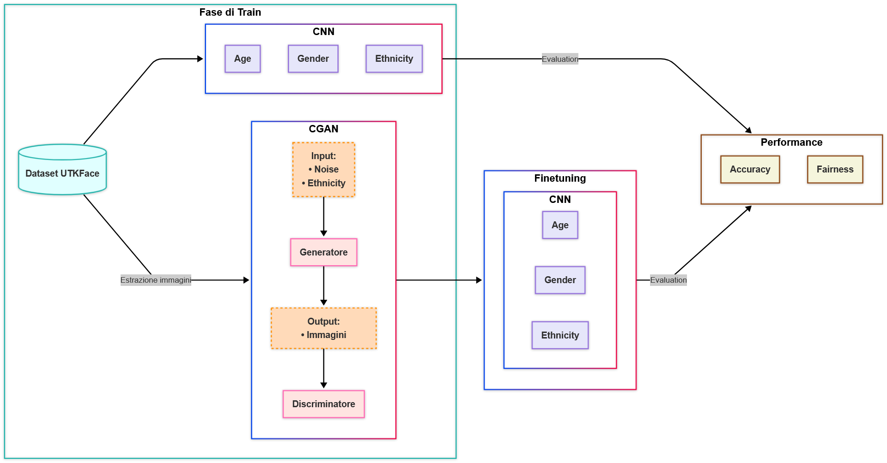

# UTKFair

  

Questo repository contiene i notebook Colab per l’addestramento dei modelli e i modelli pre-addestrati generati per il riconoscimento di età, genere ed etnia a partire dal dataset **UTKFace**. L’obiettivo è creare un flusso di lavoro completo che prevede:

1. **Addestramento iniziale (Train)** di un CNN multi-task per la stima di età, genere ed etnia su immagini di volti.
2. **Costruzione di una Conditional GAN** all’etnia per generare nuove immagini al fine di riequilibrare i dati e mitigare bias di rappresentazione.
3. **Fine‐tuning** del CNN per migliorare accuratezza e fairness.
4. **Valutazione** delle performance in termini di accuratezza e metriche di fairness.

---

## Struttura del repository

- **`notebook/`**  
  Contiene i notebook Colab utilizzati per:
  - **Train_UTKFace_Classification.ipynb**: addestramento iniziale del CNN multi‐task per età, genere ed etnia.
  - **ConditionalGAN.ipynb**: addestramento del CGAN condizionato all’etnia per generare immagini sintetiche.
  - **Finetuning_UTKFace_Classification.ipynb**: fine‐tuning del CNN sfruttando dataset originale + immagini generate dal CGAN.  
  - **Inferenza_UTKFace_Classification**: contenente il metodo `classify_face(image_path)` per utilizzare il modello a partire dalla path dell'immagine.

- **`train_model/`**  
  Contiene i pesi dei modelli salvati.

---

## Dataset UTKFace
Il dataset **UTKFace** è utilizzato come fonte primaria di immagini per l’addestramento del CNN.  
- Le immagini sono estratte e preprocessate (ridimensionamento, normalizzazione) all’interno dei notebook.
- Le etichette incluse in UTKFace sono:  
  - **Age** (età in anni)
  - **Gender** (0 = maschio, 1 = femmina)
  - **Ethnicity** (0–4, corrispondenti a diverse categorie etniche)

## Prerequisiti
- Python 3.7+
- Google Colab (consigliato per sfruttare GPU/TPU gratuite)
- Librerie principali (installabili nel notebook con `!pip install`):
  - `tensorflow`
  - `keras`
  - `numpy`, `pandas`, `matplotlib`
  - `tqdm`
  - `scikit-learn` (per calcoli di metriche)
  - `fairlearn` (per l'analisi delle metriche di fairness)
  - `dagshub` (integrato con git e MLflow)
  - `mlflow` (per monitorare, salvare e confrontare esperimenti)
   

## Autori e contatti
| Autore              | Indirizzo email                |
|---------------------|--------------------------------|
| Simona Lo Conte     | s.loconte2@studenti.unisa.it   |
| Marta Napolillo     | m.napolillo1@studenti.unisa.it |